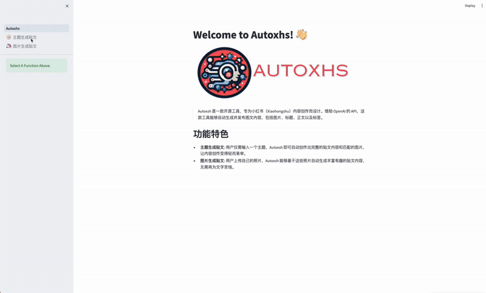
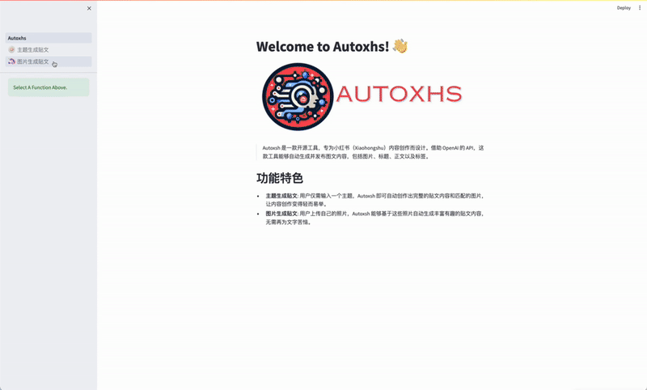

<div align="center">
    
</div>

> Autoxsh is an open-source tool designed to streamline and automate the process of generating and publishing content on Xiaohongshu (Little Red Book). By leveraging the power of OpenAI's API, Autoxsh provides a comprehensive solution for creating engaging images, titles, content, and tags with ease. 
> 
> **Access the app deployed on Streamlit Cloud for a enjoyable experience:** [](https://autoxhs.streamlit.app/)
> 
## Table of Contents

- [Features](#features)
- [Demo](#demo)
- [Getting Started](#getting-started)
- [Configuration](#configuration)
- [Supporters](#supporters)
  
## Features

- **Automated Content Creation**: Leverages OpenAI's API for generating engaging images, titles, content, and tags, streamlining content creation for Xiaohongshu.
- **LangGPT Prompt Generation & Langchian Framework**: Utilizes the LangGPT project methodology and Langchian framework for creating structured, high-quality prompts and developing language model-powered applications.
- **Customizable & User-Friendly**: Offers prompt customization and model selection options within a Streamlit-based interface, ensuring a user-friendly experience.
- **Efficient Post Generation**:  Supports both topic and image-based post generation. Users can input a topic or upload photos, and Autoxsh automatically crafts a complete, engaging post, simplifying the content creation process.

## Demo

Quick demonstrations of Autoxsh (videos accelerated for brevity):

- **Theme-Based Post Generation**: Users simply input a topic, and Autoxsh automatically crafts a complete post, including both text content and matching images.
    <div align="center">
    
</div>

- **Image-Based Post Generation**: Users can upload their own photos, and Autoxsh will generate rich and engaging post content based on these images.
    <div align="center">
    
</div>

## Getting Started
1. To install Autoxsh, follow these steps:
```bash
# Create a new conda environment with Python 3.9
conda create -n Autoxsh python=3.9

# Activate the conda environment
conda activate Autoxsh

# Clone the Autoxsh repository to your local machine
git clone https://github.com/Gikiman/Autoxhs.git

# Navigate to the Autoxsh project directory
cd Autoxhs

# Install dependencies from requirements.txt
pip install -r requirements.txt

# If you are using a Linux system, you'll need to install the corresponding dependencies
# xargs -a packages.txt sudo apt-get install -y
```

2. After installing, you can launch the application simply by running:

```bash
streamlit run Autoxhs.py
```
> Note: A high-speed internet connection is required, and users in China should use a proxy.

## Configuration
- Prompt Customization: Modify generation prompts in the `data\prompt` folder using the LangGPT methodology.
- Model Selection: Default models are `gpt-4-0125-preview` for text and `dall-e-3` for images. These can be selected in the app.

### 👏Supporters 
<!-- ### &#8627; Stargazers -->
[](https://github.com//Gikiman/Autoxhs/stargazers)
